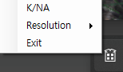

 

[Github](https://github.com/Bamtoliya/BDODESKTOPALARM-KOR-)

---

언어: C#

사용 툴: Visual Studio

--- 

미국에 있을때 검은사막 보스시간을 확인하기 위해서 제작한 간단한 알람.

검은시막 월드보스가 알리미가 언제나 한국로컬시간을 기반으로 알림을 주기 때문에,

미국에 머물때 맞지않는 시간에 알리미가 떴다. 

그게 불편해서 제작했다.

Always Top 기능으로 전체창모드일때도 확인할 수 있다.

사용자가 원하는 위치에 갖다 놓을수가 없다.

해상도에 따라 미리 지정한 좌표에만 설정가능.

---

- 고칠점:
    1. 내 환경에만 맞춰서 개발되어 있음
    2. 유지보수 할 생각이 없음.

---