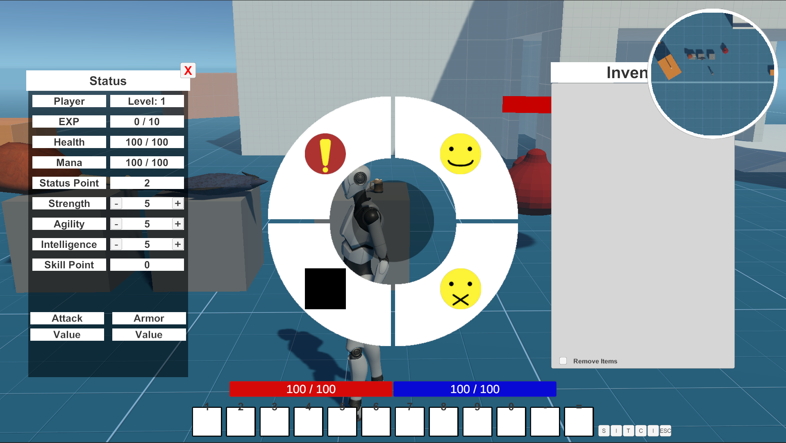

---


<iframe class="video" width="560" height="315" src="https://www.youtube.com/embed/xb8ScruyEbQ?si=qqwNEjHY7DUBPhQy" title="YouTube video player" frameborder="0" allow="accelerometer; autoplay; clipboard-write; encrypted-media; gyroscope; picture-in-picture; web-share" allowfullscreen></iframe>
 
---

- 목적: UI 수업에서 주어진 자유과제로, RPG 게임의 UI를 흉내냈다.

---

- Language: C#
- Tools: Unity Engine, Visual Studio

---

 - 구현한 기능: Drag & Drop, 인벤토리, 아이템사용, 휠메뉴, 캐릭터정보창, 스킬창, 프리셋 슬롯, 몬스터 체력바, 플레이어 상태, 미니맵
 
---

<br>

Unity에서 제공되는 3D TPS 템플릿을 기반으로 UI만 구현했다.

크게 2가지의 종류로 나뉘었다.
항상 화면에 표시되는 Static
그리고 상호작용으로 불러오는 Hidden

Static은 주로 현재 플레이어의 상황을 표현하는데 사용한다.
<br>
Hidden은 플레이어의 데이터를 더욱 상세하게 보여주는데 사용한다.


<br>
Static: 체력, 마우스클릭으로 가능한 아이콘, 프리셋 창, 미니맵
<br>
Hidden: 아이템, 스킬, 캐릭터정보창, 감정표현창, ESC Menu, 아이템정보


UI에 할당된 키입력을 받을때 미리 열려있는지 확인하고 열려있다면 창을 닫고, 할성화된 창이 없다면 연다.


시점이동을 마우스로 하기때문에 마우스 커서가 기본적으로 비활성화 되어있다.

UI를 열때 마우스 커서도 활성화시킨다.

```cs
public void CallUI()
{
    {
        if (UI.activeSelf == true)
        {
            UI.SetActive(false);
            UnityEngine.Cursor.lockState = CursorLockMode.Locked;
            UnityEngine.Cursor.visible = false;
        }
        else
        {
            UI.SetActive(true);
            UnityEngine.Cursor.lockState = CursorLockMode.None;
            UnityEngine.Cursor.visible = true;
        }
    }
}
```

불러와서 여는 모든창들은 마우스로 위치를 조정할 수 있다.

현재 선택한 창이 가장위 레이어에 위치할수 있게 조정한다.

```cs
//Move the location of the window
public void OnDrag(PointerEventData eventData)
{
    dragRectTransform.anchoredPosition += eventData.delta / canvas.scaleFactor;
}

//bring the window forward
public void OnPointerDown(PointerEventData eventData)
{
    dragRectTransform.SetAsLastSibling();
}
```

인벤토리나 스킬창에 있는 스킬에 마우스 커서를 올리면,

아이템의 데이터에 입력한 간단한 정보를 노출 시킨다.

```cs

public void DisplayItemInfo(string itemName, string itemDescription, Vector2 buttonPos)
{
    //전에 불러운 정보창을 없애기
    if(currentItemInfo != null)
    {
        Destroy(currentItemInfo.gameObject);
    }

    buttonPos.x += -150;
    buttonPos.y += 100;

    currentItemInfo = Instantiate(itemInfoPrefab, buttonPos, Quaternion.identity, canvas);
    currentItemInfo.GetComponent<ItemInfo>().SetUp(itemName, itemDescription);
}

public void DestroyItemInfo()
{
    if(currentItemInfo != null)
    {
        Destroy(currentItemInfo.gameObject);
    }
}

public void OnCursorEnter()
{
    if (item == null || isBeingDraged == true) return;
    GameManager.Instance.DisplayItemInfo(item.name, item.GetItemDescription(), transform.position);
}

public void OnCursorExit()
{
    if (item == null) return;
    GameManager.Instance.DestroyItemInfo();
}

```

<br>

Drag&Drop:

인벤토리에있는 아이템의 드래그가 시작됐을때 아이템 슬롯의 캔버스를 인벤토리에서 화면 전체 캔버스로 옮긴다.

놓았을때 현재 위치가 프리셋 UI의 위치와 겹쳐있다면 인벤토리에서 프리셋으로 옮긴다.


```cs
public void DragHandler(BaseEventData data)
{
    PointerEventData pointerData = (PointerEventData)data;
    Vector2 position;
    RectTransformUtility.ScreenPointToLocalPointInRectangle((RectTransform)canvas.transform, pointerData.position, canvas.worldCamera, out position);
    transform.position = canvas.transform.TransformPoint(position);
}

public void OnBeginDrag(PointerEventData eventData)
{
    transform.SetParent(GameManager.Instance.mainCanvas);
    itemSlot.OnCursorExit();
    itemSlot.isBeingDraged = true;
}

public void OnDrag(PointerEventData eventData)
{
    transform.position = Input.mousePosition;
}

public void OnEndDrag(PointerEventData eventData)
{
    transform.SetParent(baseParent);
    transform.SetSiblingIndex(silbingIdx);
    itemSlot.isBeingDraged = false;

    if(RectTransformUtility.RectangleContainsScreenPoint(presetRect, Input.mousePosition))
    {
        Inventory.Instance.SwitchPresetInventory(itemSlot.Item);
    }
}

```

미니맵:

카메라를 플레이어 캐릭터의 위에서 수직으로 플레이어를 쳐다보게 하고.

그걸 마테리얼 데이터로 저장, UI 테두리안에 넣어서 Late Update를 한다.

카메라의 위치를 플레이어로 이동한다.

```cs
private void LateUpdate()
{
    Vector3 newPosition = player.position;
    newPosition.y = transform.position.y;
    transform.position = newPosition;
}
```

Update 와 Late Update 의 차이점:
Update는 매프레임마다 호출되고 Late Update는 모든 Update 함수가 호출된뒤에 호출한다.
여기서 볼수있는것은 최대한 늦게 호출되므로, Update오브젝트 렌더링이나 호출 같은것을 넣은다음 Late Update로 카메라를 늦게 움직이면,
플레이어들에게 로딩되는 모습읍 안보여줄 수 있다.

Fixed Update:
주로 물리계산을 할때 사용하며 프레임대신 시간을 기준으로호출한다.


<br>

--- 
 - 프로젝트를 진행하면서 어려웠던점:
    1. 아이템과 스킬이 같은 슬롯 구조를 공유하지않아 프리셋에는 아이템 밖에 올라가지않는다.

---

- 배운점:
    1. UI를 만들떄 사용자의 시점에서 고려해야 할것. (마우스만 사용, 단축키, 보여주는것이 필요함)
    2. UI를 디자인할때 내가 생각한거보다 손이 많이간다, 제약사항도 많다. 툴을 사용하기 때문일까? 파악을 못했기 떄문일까?


- 고칠점:
    1. 자료를 저장할때 다른 구조를 사용했으면 훨씬더 RPG 스러운 인벤토리가 될거같다.
    2. 아이템이 인벤토리와 프리셋의 같은 주소만을 공유하면되는데, 각각의 리스트로 옮기는 식으로 되어있다.

---


~~[Github](https://github.com/UMBC-CMSC437-FA2022/project-mmodemo)~~