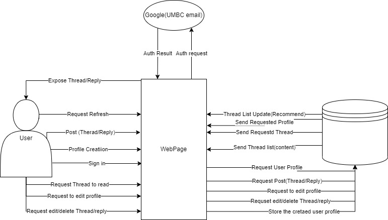
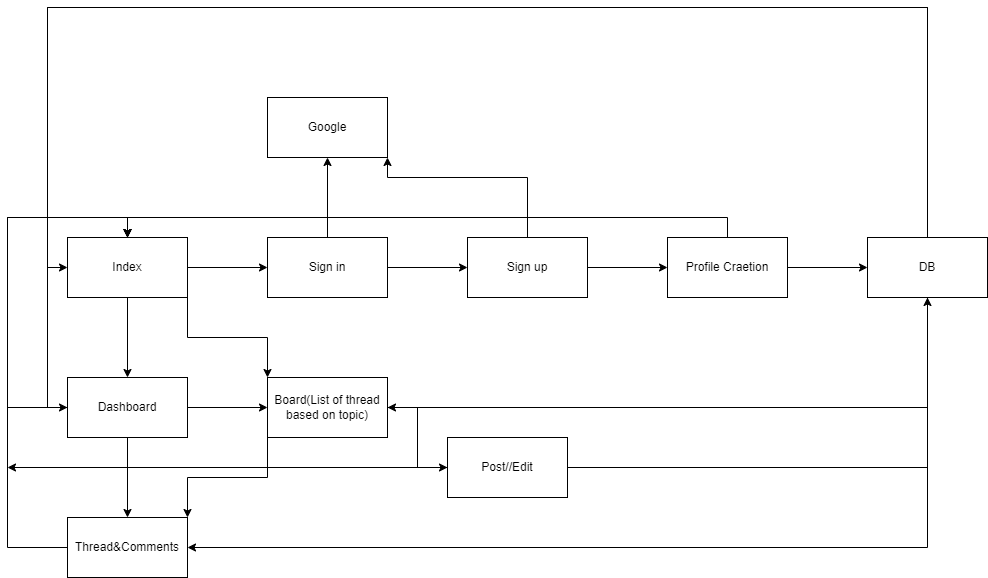
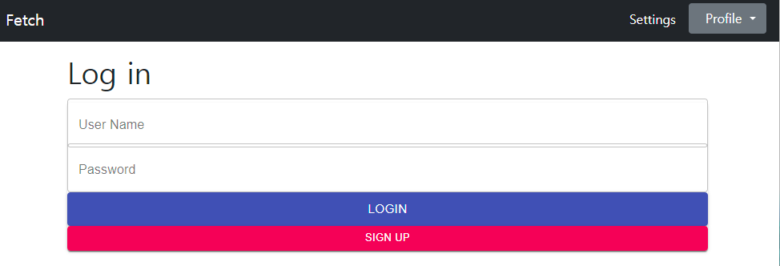
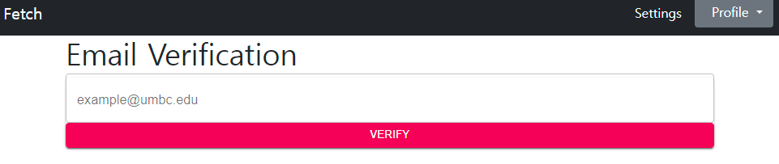
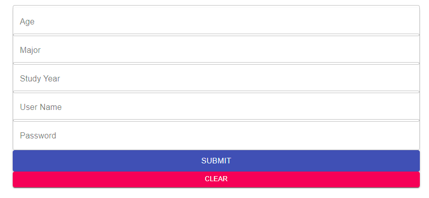
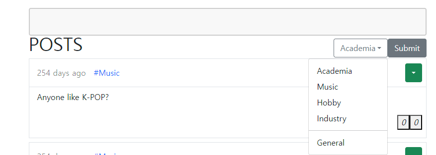
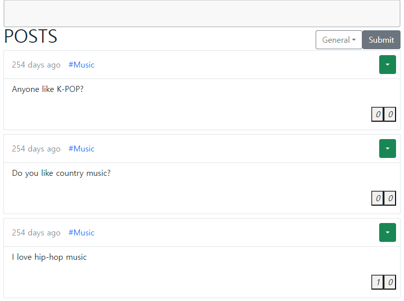
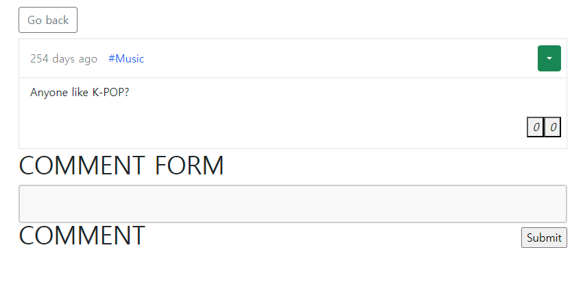

# Fectch
## 학교 구성원들만 사용할 수 있는 익명 커뮤니티 

---

---

- Language: Javascript
- Stacks: ExpressJS, NodeJS, MongoDB, ReactJS
- Tools: Figma, Git, Draw.io

---

- 인원: 5 (프론트엔드 3, 백엔드 2)
- 기간: 2022-10-05 ~ 2022-12-16 (9주)
- 내가 맡은 역할: 구조설계, 프론트엔드와 백엔드 연결
 
---

학교 과제중 하나로 진행한 팀프로젝트다.
Sofware Engineering의 수업으로
팀을 이뤄 어플리케이션 서비스를 하나 개발하는 프로젝트가 주어졌다.
팀원들과의 첫 회의에서 학교 구성원들만 사용할 수 있는 익명 커뮤니티를 서비스 하기로 했다.

핵심적으로 필요한 기능은 기본적인 CRUD와 구글 Autorize를 활용한 이메일 인증이다.

팀원들과 얘기하며 익숙한 언어와 사용했던 툴들을 이야기 나누고 역할을 나눴다.

나는 웹서비스를 주로 다루지는 않지만 혼자 공부해본적이 있기때문에,
기본적으로 무엇이 필요할지 예상할 수 있어서 구조설계를 맡았다.

사용할 프레임워크를 정하고

UML 다이어그램을 통해 필요한 클래스와 함수 등을 미리 정의했다.

그외에 이해에 필요한 프론트엔드 페이지와 백엔드의 기능을 그래픽으로 나타냈다.

로직 구조표를 작성했다.

일단 기본적인 Login 페이지

SignUp을 누르고 들어가면 가지고있는 이메일을 검사한다.
일단은 입력한 이메일이 학교이메일인지 확인한다.
원래 계획대로라면 여기에 Google Authorize를 추가해서 메일인증을 진행하겠지만 시간이 부족해 진행하지 못했다.

회원정보를 입력하는창, 통계를위해 수집하는것이며, 아이디와 비밀번호는 해쉬로 암호화하여 데이터베이스에 저장한다.

Category를 설정하여 글을 작성할수 있다.

카테고리를 누르면 필터링이되어 해당 주제만 볼수 있다.

오른쪽 드랍다운 메뉴에 들어가 코멘트를 클릭하면 작성및 코멘트를 확인할 수 있다.

--- 
 - 프로젝트를 진행하면서 어려웠던점:
    1. 팀원들과의 빠른 연락
    2. 팀원들의 진행사항을 알 수가 없었다.
    3. 익숙하지 않은 언어와 라이브러리의 사용

---

- 배운점:
    1. UML 다이어그램 작성법
    2. 의사소통의 중요성
    3. 로직 작성법
    4. 서비스를 개발할때 주의해야할 사항(보안, 유지보수, 약관)

- 고칠점:
    1. 핵심적인 기능이라고 먼저 파악하고있었으면, 미리 공부해서 적용시켜볼 것

---

[Github](https://github.com/ParagMayani/FetchCmsc447)