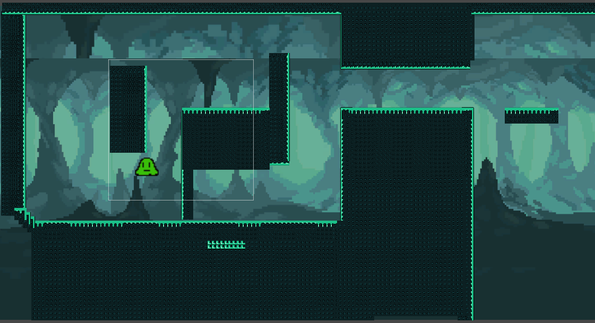

# 학교에서 진행한 Capstone Project #1

---



---

<iframe class="video" width="560" height="315" src="https://www.youtube.com/embed/iUFhRsUxtIE" title="YouTube video player" frameborder="0" allow="accelerometer; autoplay; clipboard-write; encrypted-media; gyroscope; picture-in-picture; web-share" allowfullscreen></iframe>

---

- Language: C#

- Tool: Unity Engine

---

- 목적: 학교에서 진행한 Capstone Project #1
- 인원: 3 (아티스트2, 프로그래머1)
- 기간: 2023-02-02 ~ 2023-02-23 (3주)
- 내가 맡은 역할: 프로그래머, 레벨디자인, 애니메이션 스크립트

- 구현한 기능: 캐릭터 이동, 벽점프, 대쉬기능

---

Capstone에서 두번의 프로젝트를 진행하는데

첫번째로는 작은팀으로 총 3명으로 이루어졌다.

프로그래머 1 명과 그래픽 디자이너 2명이 한팀으로

약 3주의 시간내에 한 주어진 주제를 녹여내고 한스테이지를 만드는것이 과제로 주어졌다.

<br>

나는 프로그래머로서 참여를 하게됐다.

우리팀은 주제로 벽점프가 주어졌다.

간단한 캐릭터 테마와 배경으로는 슬라임과 동굴로 정했다.

사용한 엔진은 UNITY 엔진
언제나 그렇지만 소규모 프로젝트에서 유니티의 생산성은 엄청나다.

<br>

기본적인 그래픽 기법은 픽셀아트로
배경, 지형, 캐릭터, 이펙트 정도로 나뉘었다.

프로그래머로서 해야할것은 플랫포머에서 기본적인 이동과 점프 그리고 원하는 기능을 구현해야했다.

<br>

일단은 단순한 좌우 움직임과 점프부터, 프레임마다 입력을 체크해서 입력이 들어오면 조건을 확인하고 캐릭터의 방향을 바꾼다
스페이스바 입력이 확인되면 캐릭터의 위쪽으로 가해지는 힘을 더하여 수직으로 이동시킨다.

```cs

void Flip()
{
    //Reverse the X scale of player to make the face opposite direction.
    facingRight = !facingRight;
    Vector3 theScale = transform.localScale;
    theScale.x *= -1;
    transform.localScale = theScale;
}

if (Input.GetAxis("Horizontal") > 0 && !facingRight)
{
    Flip();
}
else if (Input.GetAxis("Horizontal") < 0 && facingRight)
{
    Flip();
}

if (Input.GetButton("Jump") && (grounded || isWall))
{
    Debug.Log("Jump");
    jump = true;
    animator.SetBool("jump", jump);
    //jumpTime = 0;
}

if (jump)
{
    rb2d.AddForce(Vector2.up * jumpForce, ForceMode2D.Impulse);
    jump = false;
}

```

<br>

처음에는 단순한 점프가 아니라 차징점프가 된다면 더욱 재밌을꺼 라고 생각해서
차징점프를 구현해서 도입했다.

<br>
하지만 차징에 이어 벽 점프를 구현하다가 차징과 벽점프가 충돌해서
벽에서 속도가 무한정으로 붙어 하늘로 치솟는 경우가 발생했다.

따라서 차징점프는 취소하고 단순한 벽점프를 구현했다.

box colider와 닿아있는 오브젝트의 Tag를 확인하고 만약 Tag가 바닥이나 벽이라면 점프가 가능하게 한다.

벽에 붙어있을 경우 천천히 땅으로 떨어지게 중력을 추가했다.

```cs
if (isWall)
{				
    rb2d.velocity = new Vector2(0, -wallSlidingSpeed);
}
```


첫 플레이 테스트중 차징점프를 취소했음에도 불구하고 벽에서 속도가 엄청나게 붙는것을 발견,

모든 테스터들이 스페이스바를 단발성으로 누르지않고 길게 누르는것을 알아냈다.

<br>

더 자세히 코드를 살펴보니, 벽에 붙어있을때 Boolean이 제대로 적용되지않는것을 확인했다.

Box Colider의 사이즈를 조정하니 해결할 수 있었다.


<br>

차징점프를 위해 디자이너가 만들어둔 이펙트가 아까워서

차징점프 대신에 대쉬를 추가하였다.

대쉬하는 시간과 쿨타임간의 yield 와 wait를 걸어 사용빈도와 조작감을 조정한다.

```cs

private IEnumerator Dash()
{
    canDash = false;
    isDashing = true;
    float gravity = rb2d.gravityScale;
    rb2d.gravityScale = 0f;
    rb2d.velocity = new Vector2(transform.localScale.x * dashingPower, 0f);
    boost.SetBool("Dash", isDashing);
    yield return new WaitForSeconds(dashingTime);
    rb2d.gravityScale = gravity;
    isDashing = false;
    boost.SetBool("Dash", isDashing);
    yield return new WaitForSeconds(dashingCooldown);
    canDash = true;
}

```

만들어둔 이펙트의 방향과 커맨드를 바꾸었다.

아티스트들에게서 Sprite를 받아 애니메이션을 만들고,
받은 키 입력대로 애니메이션이 바뀌게, 컨트롤러 스크립트에 변수들을 추가선언한다.

<br>

--- 
 - 프로젝트를 진행하면서 어려웠던점:
    1. 예상했던 동작과 다르게 나올때
    2. 팀원의 무응답

---

 - 배운점:
    1. 유니티 애니메이터 사용법
    2. 작은 규모의 팀에서의 프로그래머가 해야하는 일
    3. 기본적인 게임개발의 협업 사이클

<br>

 - 고칠점: 
    1. 단순히 기능 구현이라고만 생각했지 게임이라고는 생각을 못해서 게임시작과 끝이 따로 정해져있지않다.

---