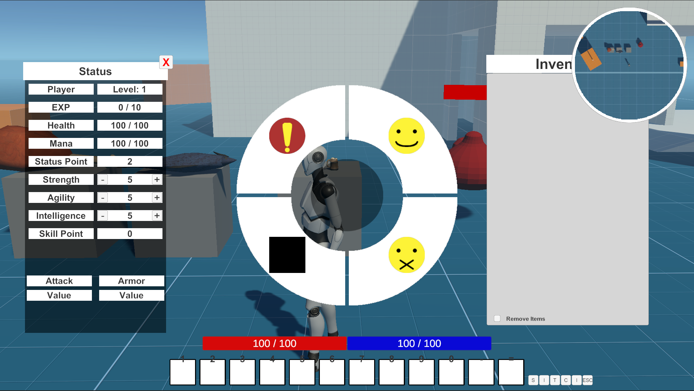

---

목적: UI 수업에서 주어진 자유과제로, RPG 게임의 UI를 흉내냈다.

---

- Language: C#
- Tools: Unity Engine, Visual Studio

---

 - 구현한 기능: Drag & Drop, 인벤토리, 아이템사용, 휠메뉴, 캐릭터정보창, 스킬창, 프리셋 슬롯, 몬스터 체력바, 플레이어 상태, 미니맵, 스킬사용
 
---

 

Unity에서 제공되는 3D TPS 템플릿을 기반으로 UI만 구현했다.

크게 2가지의 종류로 나뉘었다.
항상 화면에 표시되는 Static
그리고 상호작용으로 불러오는 Hidden

Static은 주로 현재 플레이어의 상황을 표현하는데 사용한다.
 
Hidden은 플레이어의 데이터를 더욱 상세하게 보여주는데 사용한다.

 
Static: 체력, 마우스클릭으로 가능한 아이콘, 프리셋 창
 
Hidden: 아이템, 스킬, 캐릭터정보창, 감정표현창, ESC Menu

 

---

- 배운점:
    1. 

- 고칠점:
    1. 

---

[Github](https://github.com/UMBC-CMSC437-FA2022/project-mmodemo)