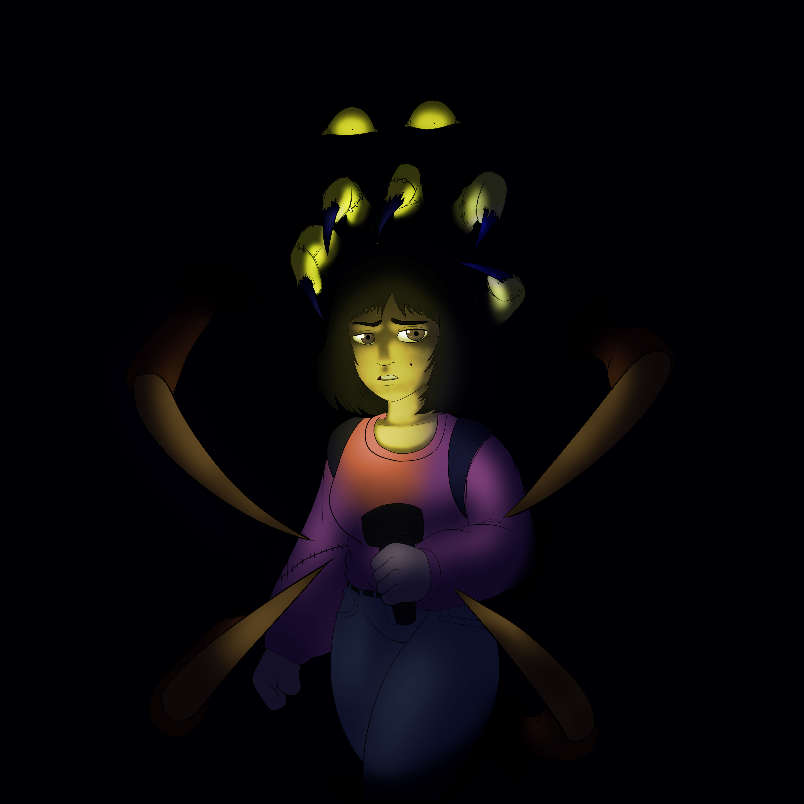

# 학교에서 진행한 Capstone Project #2
## PatchWork

---



<iframe class="video" width="640" height="360" src="https://www.youtube.com/embed/uBlF-8_ekEk" frameborder="2" allowfullscreen></iframe>


---

 - 상대를 피해 저택을 탐험하고, 탈출하자!

---

- Language: C#

- Tool: Unity Engine, Visual Studio, Google Drive

---
 - 목적: 학교에서 진행한 Capstone Project #2
 - 인원: 6 (아티스트 4, 프로그래머 2)
 - 기간: 2023-02-23 ~ 2023-05-23 (12주)
 - 내가 맡은 역할: 프로그래머, 레벨디자인
 - 구현한 기능: 2D 이동, 퍼즐, 상호작용, UI, 카메라 트랜지션, 진행방식

---

<br>
앞선 유니티 프로젝트보다 상대적으로 긴 기간이 주어진 프로젝트다.

팀원은 6명으로 아티스트 4명, 프로그래머 2명으로 구성되어있다.

자유주제로 주어졌으며, 개인적으로는 3D를 진행하고 싶었지만

2D Top-Down View로 결정 됐다.

<br>

기본적인 게임방식은 상대방을 피해 탈출하면 클리어다.

[URCAD](https://urcad.umbc.edu/) 라는 학교행사에 기간에 맞춰 발표할 수 있게끔 개발을 시작했다.


각분야의 연구 

일단 기본적인 이동방식은 WASD로 캐릭터가 상하좌우 움직일수 있게 했다.


<br>


간단한 퍼즐을 넣기위해 플레이어가 움직일수 있는 오브젝트가 있으면 상호작용키를 활성화 하여

물체를 밀거나 끌어당길수 있게하였다.

<br>


플레이어가 보고있는 방향으로 레이를 쏴 맞고있는 물체가 미리지정된 상호작용이

가능한 물체의 태그를 가지고있다면 키를 눌러 상호작용을 활성화하여 캐릭터와 같이 움직일수 있다.

<br>
오브젝트의 위치정보를 플레이어와 연결시켜 이동가능하게한다.

키를 뗀다면 위치정보를 고정,

```cs
void PushCheck()
{
    Physics2D.queriesStartInColliders = false;
    RaycastHit2D hit = Physics2D.Raycast(transform.position, facingDirection * transform.localScale.x, boxMask);
    if (hit.collider != null && hit.collider.gameObject.tag == "Box" && Input.GetKey(KeyCode.E))
    {
        box = hit.collider.gameObject;
        if(Vector2.Distance(box.transform.position, gameObject.transform.position) < distance)
        {
            box.GetComponent<FixedJoint2D>().enabled = true;
            box.GetComponent<FixedJoint2D>().connectedBody = this.GetComponent<Rigidbody2D>();
        }
    }
    else if (Input.GetKeyUp(KeyCode.E))
    {
        if(box != null)
        {
            box.GetComponent<FixedJoint2D>().connectedBody = null;
        }
    }
}

```

Key 오브젝트에 가까이 간다면 설명 UI와 상호작용키가 나타난다.

UI는 미리 지정된위치에 한정된 갯수의 키만 나타나기때문에 키 이미지들을 배열안에 저장하여 상황에맞게 Index를 불러 교체한다.

설명이 필요한 오브젝트가있다면 접촉한 물체에 적혀있는 정보를 표시힌다.

```cs
if(coll.gameObject.tag == "Key1")
{
    keyBox.SetActive(true);
    keyBox.GetComponent<SpriteRenderer>().sprite = keySprites[0];
    if (Key)
    {
        Color temp = keyBox.GetComponent<SpriteRenderer>().color;
        keyBox.GetComponent<SpriteRenderer>().color = new Color(temp.r, temp.g, temp.b, 1f);
    }
    dialogBox.gameObject.SetActive(true);
    keyBox.GetComponent<SpriteRenderer>().sprite = keySprites[0];
    dialogBox.text = coll.gameObject.GetComponent<Object>().description[0];
    Debug.Log("Collided with: " + coll.gameObject.tag);
}
```


캐릭터와 키가 상호작용하면 어떻게 작용했는지 알려주기위해서 환경이 바뀐곳으로 카메라 트랜지션을 넣었다.
넓은 시야로 볼수있게 줌아웃을하고 

```cs
if (target2 && transistion)
{
    GetComponent<Camera>().orthographicSize = 12;
    Vector3 point = GetComponent<Camera>().WorldToViewportPoint(target2.position);
    Vector3 delta = target2.position - GetComponent<Camera>().ViewportToWorldPoint(new Vector3(0.5f, 0.5f, point.z)); //(new Vector3(0.5, 0.5, point.z));
    Vector3 destination = transform.position + delta;
    transform.position = Vector3.SmoothDamp(transform.position, destination, ref velocity, dampTime);
    if(t >= 2.0)
    {
        transistion = false;
        t = 0;
    } else
    {
        t += Time.deltaTime;
    }
}
```

유니티 기능으로 라이팅을 추가, 무서운 분위기를 연출하기위해 빛이 비추는 영역외에는 어둡게 처리했다.


--- 

 - 프로젝트를 진행하면서 어려웠던점:
    1. 원래 계획대로의 모든 스테이지를 넣지 못했다는 점.

---

- 배운점:
    1. 풀게임 개발 사이클
    2. 조금더 큰 규모의 협업
    3. 팀원이 많아지면 그만큼 작업물도 많아져 정리를 잘해야 한다.

- 고칠점:
    1. 몇번의 팀프로젝트를 했지만 아직 내 역량을 잘 모르는것 같다.

---