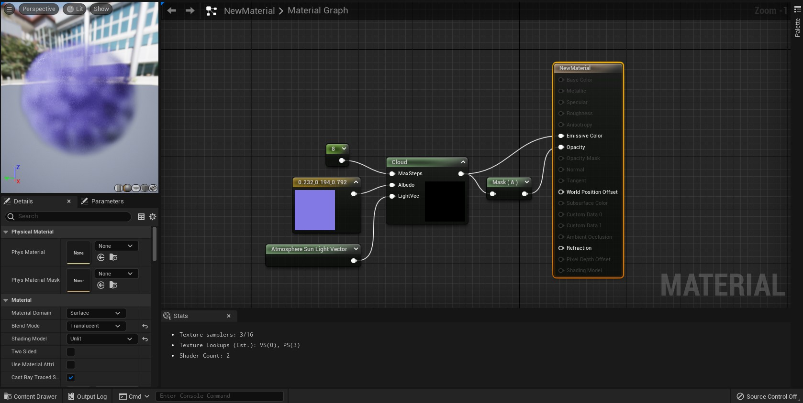

---

언어: GLSL, C++

툴: Unreal Engine, Visual Studio

---

게임에서 사용되는 컴퓨터 그래픽에대한 수업이였다.

구름을 재현하는 쉐이더를 만드는 프로젝트였다.

언리얼 엔진을 마테리얼 그래프에 쓰이는 함수 쉐이더 모둘을 제작하는 과제였다.

```cpp
void FGameModuleImpl::StartupModule()
{
	AddShaderSourceDirectoryMapping("/Game", FPaths::Combine(FPaths::ProjectDir(), TEXT("Shaders")));
}
```

```cpp
float CloudDensity(float3 P)
{
	float Mask = saturate(smoothstep(1, 0.8, dot(P,P)));
	float Noise = saturate(0.6 * FastGradientPerlinNoise3D_TEX(4 * P) + 0.4);
	return Mask * Noise;
}

float4 Cloud(FMaterialPixelParameters Parameters, int MaxSteps, float3 Albedo, float3 LightVec)
{
	float3 PositionWorld = LWCToFloat(GetWorldPosition(Parameters));
	float3 Center = LWCToFloat(GetObjectWorldPosition(Parameters));

	float Radius = GetPrimitiveData(Parameters).ObjectRadius;

	float3 P = (PositionWorld - Center) / Radius;

	float3 RayStep = -Parameters.CameraVector * (2. / MaxSteps);
	float3 ShadowStep = (2. / MaxSteps) * LightVec;

	int3 RandPos = int3(GetPixelPosition(Parameters), View.FrameNumber);
	float3 Rand = float3(Rand3DPCG16(RandPos)) / 0x10000;
	P += Rand.x * RayStep;

	float4 Color = 0;
	for (int i = 0; i < MaxSteps && dot(P, P) < 1; ++i, P += RayStep){
		float4 LocalColor = float4(Albedo, 1) * CloudDensity(P);
	

		if(LocalColor.a > 0){
			float3 SP = P + Rand.y * ShadowStep;
			float Shadow = 0;
			for(int j = 0; j < MaxSteps && dot(SP,SP) < 1; ++j, SP += ShadowStep)
				Shadow += (1 - Shadow) * CloudDensity(P);
			LocalColor.rgb *= 1 - Shadow;
		}

		Color += (1 - Color.a) * LocalColor;
	}


	return Color;
}
```


---

- 프로젝트를 통해 배운것:

 1. 언리얼 엔진에서 C++ 코드로 어떻게 모듈을 만드는지

---
